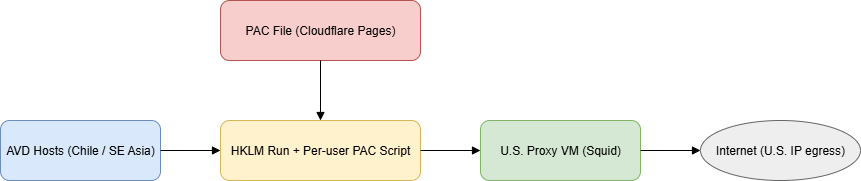

# AVD U.S. Egress Proxy – Deployment Guide

## 1. Objective
Certain insurer and healthcare portals block traffic originating outside the U.S.  

Our AVD host pools in **non-U.S. regions** (e.g., Chile Central, Southeast Asia) must selectively route those portals through a **U.S.-based proxy** while keeping all other internet traffic local.

---

## 2. Network Topology

### Virtual Networks
- **Regional AVD VNet**  
  - Example address space: `10.100.0.0/16`  

- **U.S. Proxy VNet**  
  - Example address space: `172.18.0.0/16`  

### VNet Peering
- Bidirectional peerings created:  
  - **AVD → Proxy**: allow access ✅, allow forwarded traffic ✅  
  - **Proxy → AVD**: allow access ✅, allow forwarded traffic ✅  

**Result:** AVD hosts can reach U.S. proxy private IP (e.g., `172.18.0.4`).

---

## 3. Proxy VM

- **VM size:** small (B1s or similar for testing)  
- **OS:** Ubuntu 24.04 LTS  
- **Private IP:** e.g., `172.18.0.4`  
- **Public IP:** static, used as outbound egress for insurer portals  
- **Proxy software:** Squid 6.x  

### Example Squid Config
```conf
acl SSL_ports port 443
acl Safe_ports port 80
acl Safe_ports port 443
acl CONNECT method CONNECT

# Regional AVD subnet
acl avd_region src 10.100.0.0/16

# Access policy
http_access deny !Safe_ports
http_access deny CONNECT !SSL_ports
http_access allow avd_region
http_access deny all

# Listener & logs
http_port 3128
access_log /var/log/squid/access.log
cache_log  /var/log/squid/cache.log
cache deny all
forwarded_for on
via on
dns_v4_first on
```

### Networking
- Inbound: allow TCP/3128 from AVD subnet(s).  
- Outbound: default Azure DNS + open internet.

---

## 4. PAC File

- **Public URL:** hosted via CDN or static site (e.g., Cloudflare Pages).  
- **Source of truth:** version-controlled in GitHub.  
- **Deployment:** commit to main → auto publish.

### Example PAC
```js
function FindProxyForURL(url, host) {
  var h = host.toLowerCase();

  if (dnsDomainIs(h, ".availity.com") ||
      dnsDomainIs(h, ".cigna.com") ||
      dnsDomainIs(h, ".ngsmedicare.com") ||
      dnsDomainIs(h, ".zocdoc.com") ||
      dnsDomainIs(h, "ifconfig.io") ||
      dnsDomainIs(h, "ipinfo.io")) {
    return "PROXY 172.18.0.4:3128";
  }
  return "DIRECT";
}
```

---

## 5. Deployment

### Installer Script
See [`deploy-pac.ps1`](deploy-pac.ps1) for the full script.

- Run once on each host (as SYSTEM/admin).  
- Creates a per-user script in `C:\ProgramData\CorpProxy`.  
- Adds `HKLM\Run` entry to execute it at every user logon.  

### Deployment Modes
- **Automated build (e.g., Nerdio host creation):**  
  Script runs during provisioning. VM reboot happens as part of the build → no extra reboot required.  
- **Manual deployment:**  
  If no reboot occurs during install, **manually reboot once** to finalize registration.  

---

## 6. Validation

```powershell
# Connectivity
Test-NetConnection 172.18.0.4 -Port 3128

# PAC in registry
(Get-ItemProperty "HKCU:\Software\Microsoft\Windows\CurrentVersion\Internet Settings").AutoConfigURL

# Direct vs Proxy
curl.exe https://microsoft.com
curl.exe https://ipinfo.io
```

---

## 7. Operations

- **Backups:** configure for proxy VM.  
- **HA:** single proxy VM now; roadmap = multiple Squid VMs + Azure LB.  
- **Monitoring:** Azure Monitor + Squid logs.  

### Rollback
```powershell
Remove-ItemProperty "HKLM:\Software\Microsoft\Windows\CurrentVersion\Run" -Name "ApplyPAC_HKCU"
Remove-Item "C:\ProgramData\CorpProxy\Set-PAC-HKCU.ps1"
```

---

## 8. Adding Additional AVD Pools

1. **Subnet:** identify CIDR for new pool (e.g., `10.120.0.0/16`).  
2. **VNet Peering:** peer with proxy VNet, allow forwarded traffic.  
3. **Squid ACL:** update `squid.conf` and reload.  
4. **NSG:** allow inbound TCP/3128 from new subnet.  
5. **Deployment:** push the same PAC installer script.  
6. **Validate:** test connectivity and proxy routing.

---

## 9. Architecture Diagram


